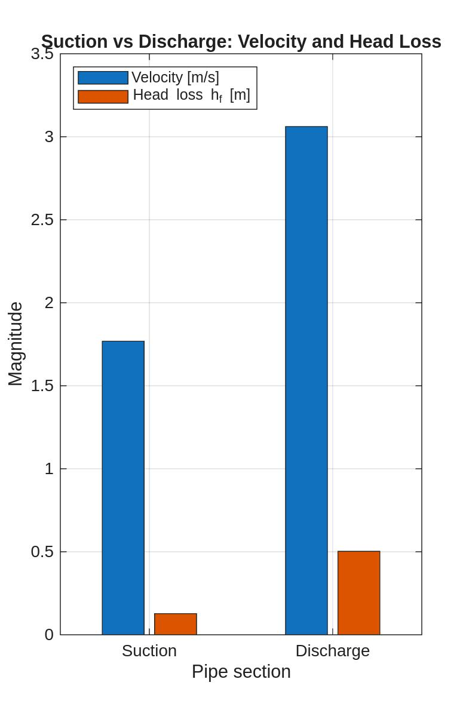

# Darcy–Weisbach Predictive Design – MATLAB Simulation  


---

## 🔹 Concept  
This project demonstrates how **fluid dynamics principles** can serve as a foundation for **physics-informed predictive maintenance**.  
Using the **Darcy–Weisbach equation**, the MATLAB simulation estimates head losses in the suction and discharge lines of a centrifugal pump, according to **API 610** standards.  

The goal is to link physical behavior (pressure losses, cavitation, vibration) to predictive models that allow machines to *learn from physics before they fail.*  

---

## 🔹 Equation  


**Variables:**  
- *h_f*: head loss [m]  
- *f*: friction factor (0.02, smooth SAIS steel pipe)  
- *L*: pipe length [m]  
- *D*: internal diameter [m]  
- *v*: average flow velocity [m/s]  
- *g*: 9.81 [m/s²]  

---

## 🔹 Configuration  

| Parameter | Suction Line | Discharge Line |
|------------|--------------|----------------|
| Diameter (D) | 0.10 m (DN100 ≈ 4″) | 0.076 m (DN80 ≈ 3″) |
| Length (L) | 4 m | 4 m |
| Flow rate (Q) | 0.0139 m³/s (≈ 50 L/s) | — (same flow) |
| Friction factor (f) | 0.02 | 0.02 |

**Technical note:**  
For this simulation, the Darcy–Weisbach equation was applied using parameters typical of **SAIS carbon-steel process piping**, with an average friction factor *f = 0.02*.  

---

## 🔹 MATLAB Results  


```matlab
>> Darcy_Weisbach_Simulation
Suction velocity = 1.77 m/s
Discharge velocity = 3.06 m/s
Suction head loss = 0.128 m
Discharge head loss = 0.503 m

